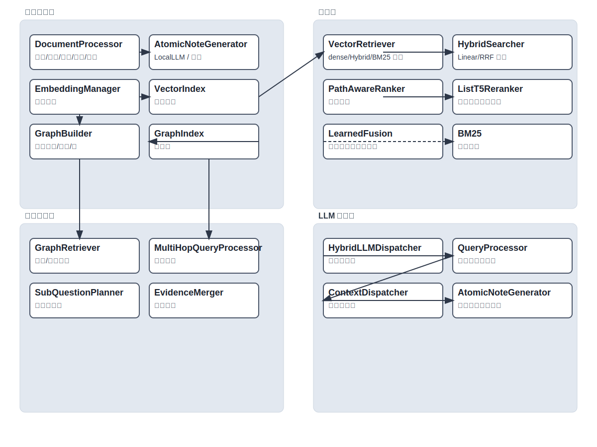
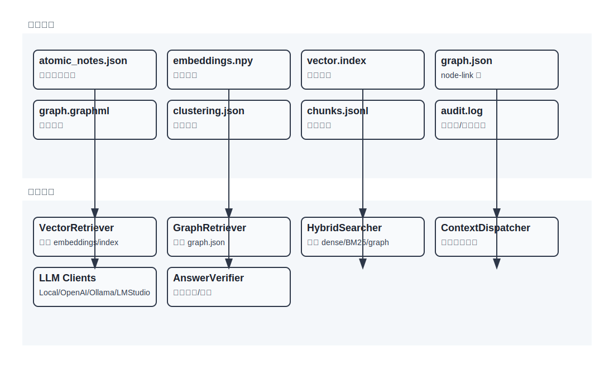

# AnoRAG：原子笔记 + 图谱增强的检索增强生成系统

简述：AnoRAG 是一个以“原子笔记”为核心的知识工程与问答系统。它将文档拆分为细粒度的语义单元（原子笔记），为其建立向量索引与主题簇，并抽取笔记间的实体/关系构建知识图谱。在查询阶段，它融合语义向量检索、词法（BM25）检索以及图路径评分，支持多跳检索与答案验证，提供可扩展、可并行的端到端 RAG 能力。

## 总览图（流程与结构）
下图展示了离线文档处理与在线查询的端到端流程，以及核心模块之间的关系与依赖，可帮助快速理解系统方法与接口边界。

  

## 配置与 IDE 补全
- 仓库中的 `configs/schema.json` 由单一的 Pydantic Schema 自动导出，描述了所有配置键、类型与默认值。
- 在 VSCode 等支持 YAML Schema 的编辑器中，可在 `config.yaml` 或 profile 文件头部声明 `# yaml-language-server: $schema=./configs/schema.json`，即可获得键名、枚举与取值范围的自动补全与校验。

  

  

## 能做什么
- 文档语义化加工：自动分块、生成风格统一的原子笔记、向量化嵌入、主题聚类。
- 知识图谱构建：从原子笔记抽取实体与关系，形成带权边的图结构，并导出 GraphML。
- 混合检索与融合：将语义向量、BM25、图路径（Path-aware）多源分数融合为统一相似度，提升召回与可解释性。
- 多跳问题求解：基于图邻域与桥接实体进行二跳/多跳检索，支持子问题分解与证据合并。
- 上下文调度与打包：在结构增强的调度器下选择最相关笔记并打包上下文，减少冗余与噪声。
- 答案定位与审核：答案片段定位（span picking）、摘要质量审计（NER+LLM 两阶段）、一致性检查与答案校验。
- 并行与增量：支持文档并行处理与查询并行检索；提供增量处理缓存与进度跟踪。

## 系统如何工作（方法流程）
1. 文档处理（离线/批处理）
   - 文档分块：根据内容结构将原文切分为粒度稳定的段（chunks）。
   - 原子笔记生成：调用本地/外部 LLM，按统一模板生成含实体与关系线索的原子笔记。
   - 嵌入与聚类：对笔记向量化并进行主题聚类，形成主题池与簇信息。
   - 图谱构建：抽取笔记之间的实体与关系，生成节点（note）与边（关系）构成的知识图谱，并可导出 GraphML。
   - 质量与一致性：对聚类与图结构进行一致性检查，必要时记录错误报告与提示修复。
2. 查询处理（在线）
   - 初始检索候选：语义向量检索与 BM25 词法检索共同给出候选集合。
   - 图谱增强与路径评分：结合图索引与路径质量，对候选进行加权与重排。
   - 多跳检索（可选）：识别桥接实体，执行第二跳检索并与第一跳证据融合。
   - 子问题分解（可选）：将复杂问题拆成子问题，分别检索与合并证据，最后调度上下文。
   - 上下文打包：在结构增强调度器下，选择最相关、覆盖度更高的笔记集合，构造提示上下文。
   - 答案生成与验证：生成最终答案，进行片段定位与质量审核，输出答案与检索明细。

## 系统结构（组件与交互）
- 文档处理层（doc/）
  - DocumentProcessor：文档处理主流程，管控分块、笔记生成、嵌入、聚类、图谱、缓存与一致性检查。
  - Chunker/Clustering/IncrementalProcessor：分块、聚类与增量处理子模块。
- LLM 适配层（llm/）
  - AtomicNoteGenerator/ParallelTaskAtomicNoteGenerator：原子笔记生成器（支持并行任务分配）。
  - LocalLLM、OllamaClient、OpenAIClient、LMStudioClient、MultiModelClient：多种 LLM 提供方与混合路由。
  - prompts：统一的系统/任务提示词模板。
- 知识图谱层（graph/）
  - GraphBuilder：从笔记与关系抽取器构建图谱；支持计算图质量指标与 GraphML 导出。
  - RelationExtractor：抽取笔记间实体与关系，生成带类型与权重的边。
  - GraphIndex/GraphRetriever：图索引与基于图的检索器，提供邻域扩展与路径评估能力。
  - MultiHopQueryProcessor：多跳查询处理组件。
- 向量与检索层（vector_store/、retrieval/）
  - EmbeddingManager/VectorIndex/VectorRetriever：向量化管理、索引与候选检索；内置 BM25 回退与召回增强。
  - HybridSearcher（retrieval/hybrid_search）：将 dense/BM25/graph/path 统一融合为最终分数，支持 linear/RRF。
  - PathAwareRanker、ListT5Reranker、LearnedFusion：路径感知重排、列表重排序与可学习融合。
  - RetrievalGuardrail、DiversityScheduler、LLMBasedRewriter：检索护栏、多样性调度与查询改写（可选）。
- 查询编排层（query/）
  - QueryProcessor：端到端查询流水线，编排混合检索、图增强、多跳/子问题分解、上下文调度与答案生成。
  - SubQuestionPlanner、EvidenceMerger、ContextPacker：子问题规划、证据合并与上下文打包。
- 上下文与工具层（context/、utils/）
  - ContextDispatcher/ContextScheduler：结构增强/传统上下文调度器。
  - EnhancedNER、SummaryAuditor、ConsistencyChecker：实体识别、摘要审计与一致性检查。
  - FileUtils、BatchProcessor、ProgressTracker、Logging：通用工具与并行/进度支持。
- 并行执行层（parallel/）
  - ParallelEngine/Interface：文档与查询的并行执行框架，支持多策略（数据复制/拆分/任务分发/混合）。
- 答案与评估（answer/、eval/、training/）
  - SpanPicker、VerifyShell：答案片段定位与外壳验证。
  - EnhancedEvaluator/QA 覆盖度：评估指标与覆盖度估计。
  - training/calibrate：融合与评分的校准训练流程。

## 数据与产物（典型输出）
- 原子笔记集合：atomic_notes.json（或 processed/atomic_notes.json）。
- 向量嵌入：embeddings.npy 与向量索引（faiss/自定义索引文件）。
- 主题聚类：clustering.json（包含簇分配、主题池与簇统计）。
- 知识图谱：graph.json（node-link 格式）与 graph.graphml（可视化/分析）。
- 分块数据：chunks.jsonl（可追踪原文来源与段落映射）。
- 日志与报告：一致性报告、审计标记、进度日志与性能统计。

## 关键设计与优势
- 原子笔记为核心：以最小语义单元组织知识，便于检索、聚类与关系抽取。
- 图谱增强检索：结合图邻域与路径质量为候选加权，提升复杂查询的可解释性与可靠性。
- 混合分数融合：统一融合 dense/BM25/graph/path，支持线性与 RRF，两者均可配置权重与超参。
- 多跳与子问题：自然支持桥接实体与多跳推理；复杂问题拆解为可控的检索与合并流程。
- 质量保障：NER+LLM 的两阶段摘要审计与一致性检查，降低信息缺失与结构错误风险。
- 并行与增量：面向工程的并行调度与缓存管理，适配大规模文档与高并发查询。
- 可扩展与可插拔：LLM 提供方、融合器、重排器、护栏与调度器均以配置驱动、模块化实现。

## 模块职责一览（简表）
- doc/document_processor.py：离线处理流水线与缓存/一致性管理。
- graph/graph_builder.py：图谱构建与关系注入。
- retrieval/hybrid_search.py：多源分数融合器。
- vector_store/retriever.py：向量检索、BM25 回退与召回增强。
- query/query_processor.py：查询主编排与多跳/子问题/调度/答案生成。
- utils/*：工具箱（NER、审计、一致性、并行、日志、进度等）。
- llm/*：LLM 客户端与原子笔记生成器。
- parallel/*：并行执行框架。
- answer/*：答案片段定位与验证。

## 适用场景与边界
- 适合需要结构化知识组织与可解释检索的企业知识库、学术资料库与长文档问答。
- 对关系抽取质量与图谱连通性有一定依赖；可通过校准与护栏提升稳健性。
- 多跳与子问题会增加时延与复杂度，建议按需求在配置中启用/调整。

## 未来方向
- 引入更强的关系抽取模型与事件图谱支持。
- 提升跨文档实体对齐与别名归并质量。
- 加强可学习融合与在线校准，进一步优化不同检索信号的协同效果。

——
如需按你的数据与任务进行定制（例如更强的子问题规划、特定领域实体规范化、融合权重校准等），可以基于配置与模块化接口快速扩展。