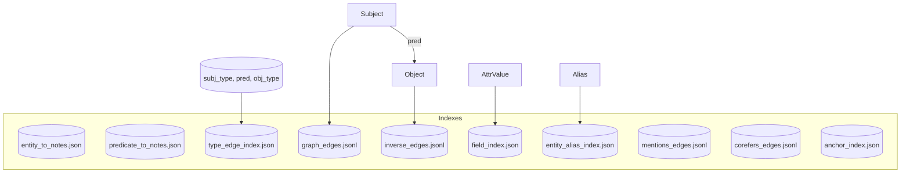

# ANO-RAG：结构化 RAG 最小实现

以三元组“原子笔记”为核心的两阶段 RAG：构建阶段将文档抽取为规范化事实笔记并写出多类索引；检索阶段在结构空间内执行别名绑定与图遍历，融合弱信号兜底，最终将证据交给 LM 接口生成答案。

## 为什么选择结构化

- 可解释性强：检索路径由显式边与类型约束组成，可回溯至 `note_id` 与证据文本。
- 精准受控：类型边与谓词归一限制不合理跳转，职业等属性统一归一提升一致性。
- 别名稳健：实体别名索引与查询端归一协同，跨语体/噪声条件下仍保持稳定召回。
- 易于扩展：索引是轻量 JSON/JSONL；可增量构建嵌入与 BM25 以增强弱信号。

## 架构图

端到端流程示意：

```mermaid
flowchart LR
  subgraph Build [构建阶段]
    A[Documents (.txt/.md/.jsonl/.json)] --> B[Chunker]
    B --> C[NoteGenerator (vLLM)]
    C --> D[Validators & Normalization]
    D --> E[IndexBuilder]
    E --> F[(Indexes)]
  end

  subgraph Query [检索与答案阶段]
    Q[Question] --> ID[IntentDetector]
    ID --> PR[Parser → IR]
    PR --> OP{Operators\nBIND / EXPAND}
    OP --> RP[Retriever Pipeline]
    RP --> EV[Evidence Extraction]
    EV --> AN[Answerer → LM Studio]
    RP -. Fallback: Vector / BM25 .-> EV
  end

  F --> RP
```

索引结构示意：


```mermaid
flowchart TB
  subgraph IDX [Indexes]
    E1[(entity_to_notes.json)]
    E2[(predicate_to_notes.json)]
    T[(type_edge_index.json)]
    GE[(graph_edges.jsonl)]
    IE[(inverse_edges.jsonl)]
    FI[(field_index.json)]
    AL[(entity_alias_index.json)]
    ME[(mentions_edges.jsonl)]
    CE[(corefers_edges.jsonl)]
    AC[(anchor_index.json)]
  end

  S[Subject] -->|pred| O[Object]
  S --> GE
  O --> IE
  STP[(subj_type, pred, obj_type)] --> T
  Alias --> AL
  AttrValue --> FI
```

更多详图可在 `doc/architecture.mmd` 中查看与维护。

## 快速开始

- 依赖安装：`pip install -r requirements.txt`（可选安装嵌入/FAISS/BM25 相关包）
- 服务准备：确保有 vLLM 与 LM Studio 的 OpenAI 风格 HTTP 接口。
- 可选配置：在 `config.yaml` 修改 `vllm.*`、`lmstudio.*`、`notes.*`、`chunk.*`。

构建笔记与基础索引：

```bash
python main.py process \
  --data-dir data/sample \
  --vllm-endpoint http://127.0.0.1:8000/v1 \
  --vllm-model qwen2.5-7b-instruct \
  --temperature 0.0 \
  --max-tokens 8000
```

- 默认输出：`notes/notes.jsonl`、`notes/chunks.jsonl`、`indexes/`（见“索引说明”）。
- 可通过 `--notes-out` 与 `--indexes-dir` 覆盖输出路径。

查询并生成答案：

```bash
python main.py query \
  "Who is the spouse of the Green performer?" \
  --indexes-dir indexes \
  --notes-path notes/notes.jsonl \
  --lmstudio-endpoint http://127.0.0.1:1234/v1 \
  --lmstudio-model openai/gpt-oss-20b
```

输出为 JSON，包含结构化检索结果与答案文本（若配置了 LM 接口）。

## 索引说明

- `entity_to_notes.json`：实体到笔记倒排。
- `predicate_to_notes.json`：谓词到笔记倒排。
- `type_edge_index.json`：`(subj_type, pred, obj_type)` 到笔记的类型边索引。
- `graph_edges.jsonl` / `inverse_edges.jsonl`：有向/反向图边（含 `note_id`）。
- `field_index.json`：属性值归一倒排（如 occupation）。
- `entity_alias_index.json`：别名到实体集合。
- `mentions_edges.jsonl`：从证据文本抽取的实体提及。
- `corefers_edges.jsonl`：笔记到主体实体的共指边。
- `anchor_index.json`：每条笔记的锚点实体（若唯一可判定）。
- `manifest.json`：索引清单与计数信息。

## 架构与代码位置

- `pipeline/structured_builder.py`：统一构建器，遍历数据源、分块、抽取、写出索引。
- `doc/chunker.py`：句级滑窗分块，参数来自 `config.chunk`（`n_sent`、`overlap`）。
- `generator/note_generator.py`：调用 vLLM 抽取严格 JSON；`generator/note_parsing.py` 负责容错解析；`validators/note_validator.py` 执行校验与归一。
- `indexer/index_builder.py`：从 `notes.jsonl` 构建上述各类索引。
- `retriever/`：结构化检索（别名绑定、图扩展、打分与兜底），总控在 `retriever/pipeline.py`。
- `generator/answerer.py`：将结构化证据传给 LM Studio 生成自然语言答案。
- `main.py`：CLI 入口（`process` / `query`）。
- `baselines/`：对比实验或外部基线（含 MIRAGE 用的 `naive_rag` 与直接无检索的 `direct_llm`，后续可放 LightRAG/GraphRAG 等）。

## 配置与并发

- 通过 `config.yaml` 或默认配置（`config/config_loader.py`）管理：
  - `vllm.endpoint`, `vllm.model`, `vllm.temperature`, `vllm.max_tokens`
  - `vllm.concurrency.max_workers`：并发线程数（默认 `8`），线程池保持满载提交。
  - `vllm.concurrency.endpoints`：可选多端点列表，启用轮询均衡。
  - `vllm.concurrency.timeout_sec` 与 `retry_backoff`：HTTP 超时与重试退避。
  - `lmstudio.endpoint`, `lmstudio.model`
  - `notes.out_path`, `notes.indexes_dir`
  - `chunk.n_sent`, `chunk.overlap`, `chunk.max_tokens`
  - `parsing.*`, `schema_guard.*`：解析与类型守卫。
- 环境变量：支持 `VLLM_ENDPOINT{N}`（如 `VLLM_ENDPOINT0`, `VLLM_ENDPOINT1`）覆盖端点列表以进行轮询。

## 进阶：向量与 BM25

- 构建嵌入索引（FAISS，可选）：

```bash
python -m indexer.embedding_index
```

- 构建 BM25 语料（可选，需在 `config.yaml` 开启 `retriever.bm25.enabled: true`）：

```bash
python -m indexer.bm25_index
```

- 或使用脚本一次生成两者：`scripts/build_indexes.sh`

## 多源检索 & 嵌入模型预下载

- 检索开关：在 `config.yaml` 或 `config/config_loader.py` 中管理 `retriever.structured.enabled`、`retriever.embedding.enabled`、`retriever.bm25.enabled` 即可按需融合结构 / 向量 / BM25 三路（查询阶段 `retriever/pipeline.py::_maybe_run_hybrid` 会按权重融合）。
- 新的嵌入配置：`retriever.embedding.cache_dir`（Hugging Face 缓存目录）、`model_path_override`（本地模型文件夹）、`download_dir`（ huggingface-cli `--local-dir` 默认位置）、`device`（默认为 `system.device`）、`auto_build`（在 `scripts/mirage/build_notes.sh` 完成后自动调用 `scripts/build_indexes.sh`）。
  另外新增 `dtype`（如 `bfloat16`/`float16`），可以在加载 embedding 模型时直接控制精度，降低显存占用。
- 环境变量覆盖：`EMB_CACHE_DIR`、`EMB_MODEL_PATH`、`EMB_DOWNLOAD_DIR` 分别覆盖上述三个目录，类似 `VLLM_DOWNLOAD_DIR`。
- 预下载脚本：`scripts/download_embedding_model.sh` 会读取配置中的模型与目录，封装 `huggingface-cli download`，将例如 `Qwen/Qwen3-Embedding-8B` 的权重预拉到本地缓存或 `--local-dir`；可用 `--model/--cache-dir/--local-dir` 快速覆盖。
- 推荐脚本顺序：
  1. `scripts/mirage/build_notes.sh`（生成 notes + 结构索引，若 `retriever.embedding.auto_build=true` 会自动补齐 FAISS/BM25）。
  2. `scripts/download_embedding_model.sh`（可在首次部署或模型更新时运行）。
  3. `scripts/build_indexes.sh`，或单独执行 `python -m indexer.embedding_index` / `python -m indexer.bm25_index` 以对齐向量/BM25 索引。
- 索引构建完成后，将 `retriever.embedding.model_path_override` 指向本地目录（或仅设置 `cache_dir`），查询即会自动走结构 + BM25 + 嵌入的多源检索。
- `scripts/mirage/build_notes.sh` 会在工作目录下生成 `config.override.yaml`，并通过环境变量 `ANO_RAG_CONFIG` 让后续 Python 命令（包括 `scripts/build_indexes.sh`）自动读取同一份配置，从而把 notes/FAISS/BM25 统一写进本次 run 的 `WORK_DIR`。

## 常见问题

- 报错缺少索引文件：先运行 `python main.py process` 以生成基础索引。
- vLLM/LM Studio 未配置：CLI 支持通过 `--vllm-endpoint/--vllm-model` 与 `--lmstudio-endpoint/--lmstudio-model` 明确传参；也可在 `config.yaml` 中设置默认值。
- 大文档构建吞吐：适当提高 `vllm.concurrency.max_workers` 并使用多端点轮询；根据服务参数（如 `--max-num-batched-tokens`）调优吞吐。

——

本仓库侧重“结构化检索可解释性”，在复杂问题上可进一步扩充谓词库与类型约束，并引入学习型重排与向量融合以提升表现。

- 双卡脚本（自动拉起 vLLM 并并行分片）：`scripts/mirage/build_notes.sh`。
  - 若启用多端点，可在 `config.yaml` 中添加 `vllm.concurrency.endpoints: [http://127.0.0.1:8001/v1, http://127.0.0.1:8002/v1]`，并相应提高 `max_workers` 以压满吞吐；同时建议设置 `retry_backoff`，在端点短时失败时快速切换与退避。

### 并发调优建议

- 连接池：每个线程拥有复用的 `requests.Session`，连接池大小按 `max_workers` 自动扩展，无需手动设置。
- 饱和策略：我们在 `StructuredBuilder` 与 `main_build_notes` 中采用“完成即补位”的饱和提交策略，确保线程数始终保持在上限附近。
- vLLM 参数配合：留意 `--max-num-batched-tokens`、`--gpu-memory-utilization` 等；当响应超时或队列过长时，适当降低 `max_workers` 或提高上述阈值。
- 容错与回退：启用 `retry_backoff` 可降低短时错误的影响；在多端点场景下，轮询策略会在失败后切换端点。

#### 自适应并发（可选）

- 在 `config.yaml` 打开：

```yaml
vllm:
  adaptive:
    enabled: true
    min_workers: 4
    max_workers: 32
    target_p50_ms: 1200
    target_p95_ms: 3500
    step_up: 2
    step_down: 2
    window_size: 50
    cool_down_sec: 5.0
```

- 机制：生成器在每次 vLLM 调用后记录延迟，构建器每隔 `cool_down_sec` 读取建议并动态调整目标并发。线程池上限固定为 `adaptive.max_workers`，实际 `inflight` 会在建议值附近波动，趋近 GPU 的可承载吞吐。
- 什么时候有用：
  - 端点吞吐随时间波动（队列长度变化、临时降速）。
  - 多端点轮询时，整体延迟特征变化明显。
- 注意：如 vLLM 已通过 `--max-num-batched-tokens`/`--gpu-memory-utilization` 等充分调优，开启自适应并发通常仍能微调队列压力，但也可能引入轻微波动；保守做法是设置较小的 `step_up/step_down` 与适当的 `cool_down_sec`。

## 依赖

- 见 `requirements.txt`。需准备可用的 vLLM 与 LM Studio 服务。

## 开发建议

- 为新领域扩充 `schema/aliases.json` 与 `schema/vocab.json`，提升规范化与别名召回。
- 在 `retriever/operators.py` 中增加领域图算子与重排策略。
- 结合 `meta.final_conf` 与 `quality_score` 设计可回答性策略与拒答。
