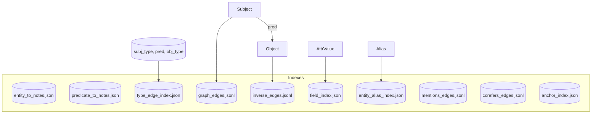

# ANO-RAG：结构化三元组笔记 RAG

Ano‑RAG 是一个以“原子笔记（subj–pred–obj）”为中间表示的两阶段 RAG 最小实现：

1. **构建阶段**：对文档做句级滑窗分块，调用 vLLM 抽取严格 JSON 的事实笔记，完成校验/归一后写出轻量结构索引（倒排、类型边、图边、属性值倒排、别名与提及/共指等）。
2. **查询阶段**：把自然语言问题解析为结构化 IR，在索引中执行别名绑定与图扩展并做路径打分；当结构信号不足时，可在候选范围内用向量/BM25 兜底；最终把证据交给 LM Studio（或任意 OpenAI 兼容端）生成答案。

## 为什么选择结构化

- **可解释**：检索路径由显式图边与类型约束组成，可回溯到 `note_id` 与证据文本。
- **可控**：谓词/类型归一限制不合理跳转；occupation 等字段值统一归一提升一致性。
- **稳健**：实体别名索引 + 查询端归一协同，噪声/跨语体条件下仍保持稳定召回。
- **易扩展**：索引全为 JSON/JSONL；可增量补齐嵌入与 BM25 作为弱信号。

## 架构概览

端到端流程：

```mermaid
flowchart LR
  subgraph Build [构建阶段]
    A[Documents (.txt/.md/.jsonl/.json)] --> B[Chunker]
    B --> C[NoteGenerator (vLLM)]
    C --> D[Validators & Normalization]
    D --> E[IndexBuilder]
    E --> F[(Indexes)]
  end

  subgraph Query [检索与答案阶段]
    Q[Question] --> ID[IntentDetector]
    ID --> PR[Parser → IR]
    PR --> OP{Operators\nBIND / EXPAND}
    OP --> RP[Retriever Pipeline]
    RP --> EV[Evidence Extraction]
    EV --> AN[Answerer → LM Studio]
    RP -. Fallback: Vector / BM25 .-> EV
  end

  F --> RP
```

索引结构示意：


```mermaid
flowchart TB
  subgraph IDX [Indexes]
    E1[(entity_to_notes.json)]
    E2[(predicate_to_notes.json)]
    T[(type_edge_index.json)]
    GE[(graph_edges.jsonl)]
    IE[(inverse_edges.jsonl)]
    FI[(field_index.json)]
    AL[(entity_alias_index.json)]
    ME[(mentions_edges.jsonl)]
    CE[(corefers_edges.jsonl)]
    AC[(anchor_index.json)]
  end

  S[Subject] -->|pred| O[Object]
  S --> GE
  O --> IE
  STP[(subj_type, pred, obj_type)] --> T
  Alias --> AL
  AttrValue --> FI
```

更细的图示维护在 `doc/architecture.mmd`。

## 快速开始

### 1) 安装依赖

```bash
pip install -r requirements.txt
```

如需启用向量/FAISS 或 BM25，可按 `requirements.txt` 里的可选依赖安装对应包。

### 2) 准备服务

- vLLM（用于笔记抽取），需提供 OpenAI 风格 `chat/completions` 端点。
- LM Studio/兼容端（用于最终回答，可选）。

### 3) 构建笔记与结构索引

```bash
python main.py process \
  --data-dir data/sample \
  --vllm-endpoint http://127.0.0.1:8000/v1 \
  --vllm-model qwen2.5-7b-instruct \
  --temperature 0.0 \
  --max-tokens 8000
```

- 默认输出：`notes/notes.jsonl`、`notes/chunks.jsonl`、`indexes/`。
- 可通过 `--notes-out`、`--indexes-dir` 覆盖输出路径。

### 4) 查询并生成答案

```bash
python main.py query \
  "Who is the spouse of the Green performer?" \
  --indexes-dir indexes \
  --notes-path notes/notes.jsonl \
  --lmstudio-endpoint http://127.0.0.1:1234/v1 \
  --lmstudio-model openai/gpt-oss-20b
```

输出为 JSON，包含结构化检索结果、证据与答案文本。

## 索引说明

- `entity_to_notes.json`：实体到笔记倒排。
- `predicate_to_notes.json`：谓词到笔记倒排。
- `type_edge_index.json`：`(subj_type, pred, obj_type)` 到笔记的类型边索引。
- `graph_edges.jsonl` / `inverse_edges.jsonl`：有向/反向图边（含 `note_id`）。
- `field_index.json`：属性值归一倒排（如 occupation）。
- `entity_alias_index.json`：别名到实体集合。
- `mentions_edges.jsonl`：从证据文本抽取的实体提及边。
- `corefers_edges.jsonl`：笔记到主体实体的共指边。
- `anchor_index.json`：笔记锚点实体（若唯一可判定）。
- `manifest.json`：索引清单与计数信息。

可选弱信号索引：

- `indexes/faiss/*`：嵌入索引（FAISS）。
- `indexes/bm25/*`：BM25 语料与倒排。

## 代码位置

- 构建：`pipeline/structured_builder.py`（总控） → `doc/chunker.py`（分块） → `generator/`（笔记抽取/解析/校验） → `indexer/index_builder.py`（写索引）。
- 查询：`query/query_processor.py`（入口） → `retriever/`（IR 解析、BIND/EXPAND、打分/兜底） → `generator/answerer.py`（最终回答）。
- CLI：`main.py`（`process` / `query`）。
- 对比基线：`baselines/` 与 `scripts/*/baselines/`（详见 `baselines/USAGE.md`、`doc/*_baseline_commands.md`）。

## 配置与并发

配置可在根目录 `config.yaml` 覆盖默认值（`config/config_loader.py`）：

- vLLM：
  - `vllm.endpoint` / `vllm.model` / `vllm.temperature` / `vllm.max_tokens`
  - `vllm.concurrency.max_workers`：并发线程数（默认 `16`）。
  - `vllm.concurrency.endpoints`：多端点轮询池（不填则用单端点）。
  - `vllm.concurrency.connect_timeout_sec` / `read_timeout_sec` / `retry_*`：超时与重试退避。
  - `vllm.adaptive.*`：可选自适应并发（见下方示例）。
- LM Studio：
  - `lmstudio.endpoint` / `lmstudio.model` / `lmstudio.temperature` / `lmstudio.max_tokens`
- 其他：
  - `notes.out_path` / `notes.indexes_dir`
  - `chunk.n_sent` / `chunk.overlap` / `chunk.max_tokens`
  - `parsing.*` / `schema_guard.*`

环境变量：

- `ANO_RAG_CONFIG`：指向任意配置文件（per‑run 覆盖）。
- `VLLM_ENDPOINT{N}`（如 `VLLM_ENDPOINT0`/`1`）：覆盖端点列表以进行轮询。
- `EMB_CACHE_DIR` / `EMB_MODEL_PATH` / `EMB_DOWNLOAD_DIR` / `EMB_DEVICE` / `EMB_DTYPE`：覆盖嵌入模型缓存/本地路径/下载目录/设备/精度。

### 自适应并发（可选）

```yaml
vllm:
  adaptive:
    enabled: true
    min_workers: 4
    max_workers: 32
    target_p50_ms: 1200
    target_p95_ms: 3500
    step_up: 2
    step_down: 2
    window_size: 50
    cool_down_sec: 5.0
```

机制：构建器采样 vLLM 调用延迟，并在 `cool_down_sec` 的周期内动态调整目标并发，使吞吐接近 GPU 可承载上限。

## 进阶：向量与 BM25

构建嵌入索引（FAISS，可选）：

```bash
python -m indexer.embedding_index
```

构建 BM25 语料（可选，需在 `config.yaml` 开启 `retriever.bm25.enabled: true`）：

```bash
python -m indexer.bm25_index
```

或使用脚本一次生成两者：`scripts/build_indexes.sh`。

## 多源检索 & 嵌入模型预下载

- 检索开关：`retriever.structured.enabled`、`retriever.embedding.enabled`、`retriever.bm25.enabled` 控制三路召回与融合。
- 嵌入配置：
  - `retriever.embedding.cache_dir`：Hugging Face 缓存目录。
  - `retriever.embedding.model_path_override`：本地模型文件夹（优先于远端下载）。
  - `retriever.embedding.download_dir`：`huggingface-cli download --local-dir` 默认目录。
  - `retriever.embedding.device` / `dtype`：加载设备与精度。
  - `retriever.embedding.auto_build`：在 `scripts/mirage/build_notes.sh` 完成后自动调用 `scripts/build_indexes.sh`。
- 预下载脚本：`scripts/download_embedding_model.sh` 读取上述配置封装 `huggingface-cli download`，可通过 `--model/--cache-dir/--local-dir` 临时覆盖。
- 推荐脚本顺序：
  1. `scripts/mirage/build_notes.sh`
  2. `scripts/download_embedding_model.sh`
  3. `scripts/build_indexes.sh`（或单独跑 `indexer.embedding_index` / `indexer.bm25_index`）

## 常见问题

- **缺索引文件**：先运行 `python main.py process`。
- **端点/模型未配置**：用 CLI 传参或在 `config.yaml` 设默认值。
- **构建吞吐不足**：提高 `vllm.concurrency.max_workers` 或配置多端点轮询，并结合 vLLM 的 `--max-num-batched-tokens`/`--gpu-memory-utilization` 调优。

## 开发建议

- 为新领域扩充 `schema/aliases.json` 与 `schema/vocab.json`。
- 在 `retriever/operators.py` 增加领域图算子/重排策略。
- 结合 `meta.final_conf` 与 `meta.quality_score` 设计可回答性与拒答策略。
