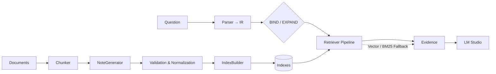

# ANO-RAG 简介

ANO-RAG 是一个以“结构化事实笔记（subj–pred–obj）”为核心的最小 RAG 实现。它将端到端流程拆分为两阶段：

1) 构建阶段：把原始文档切分为句级窗口，调用 vLLM 抽取严格 JSON 的事实笔记，随后进行校验与归一，并写出轻量索引（倒排、类型边、图边、属性值倒排、别名、mentions/corefers/anchor）。
2) 检索阶段：将自然语言问题解析为结构化 IR，在索引中执行别名绑定与图扩展，进行路径打分与属性感知重排；当结构信号不足时，在结构范围内进行向量/或 BM25 兜底；最终把证据交给 LM 接口生成答案。

## 动机

- 可解释性：检索是在图和类型约束下进行，证据可回溯到具体 `note_id` 与文本片段。
- 稳健性：别名与属性值归一减少文体差异与噪声影响，提升实体绑定与属性检索的稳定性。
- 可控性：通过谓词与类型组合限制不合理跳转；职业等属性统一归一，使重排更一致。
- 轻量与可扩展：所有索引均为 JSON/JSONL，可增量构建嵌入与 BM25，易于部署与调试。

## 架构概览

- 输入与分块：`doc/chunker.py` 句级滑窗分块（`config.chunk.*` 控制窗口与重叠）。
- 笔记生成：`generator/note_generator.py` 调用 vLLM 输出严格 JSON；`generator/note_parsing.py` 做健壮解析；`validators/note_validator.py` 执行类型/谓词归一与质量评估。
- 索引构建：`indexer/index_builder.py` 从 `notes.jsonl` 写出：
  - 实体/谓词倒排：`entity_to_notes.json`、`predicate_to_notes.json`
  - 类型边索引：`type_edge_index.json`
  - 图边：`graph_edges.jsonl`、`inverse_edges.jsonl`
  - 属性值倒排：`field_index.json`（含职业值统一与简单词干）
  - 别名索引：`entity_alias_index.json`
  - 证据派生边：`mentions_edges.jsonl`、`corefers_edges.jsonl`
  - 锚点实体：`anchor_index.json`
  - 清单：`manifest.json`
- 检索与答案：`retriever/pipeline.py` 执行 BIND/EXPAND、路径打分与兜底；`generator/answerer.py` 把证据传给 LM Studio 生成答案。

### 架构图



## 使用方式（概要）

- 构建：

```bash
python main.py process \
  --data-dir data/sample \
  --vllm-endpoint http://127.0.0.1:8000/v1 \
  --vllm-model qwen2.5-7b-instruct
```

- 查询：

```bash
python main.py query \
  "Who is the spouse of the Green performer?" \
  --lmstudio-endpoint http://127.0.0.1:1234/v1 \
  --lmstudio-model openai/gpt-oss-20b
```

## 扩展能力

- 向量索引：`python -m indexer.embedding_index`（FAISS，可选）。
- BM25 语料：`python -m indexer.bm25_index`（在 `config.yaml` 开启 `retriever.bm25.enabled: true`）。
- 脚本一键：`scripts/build_indexes.sh` 将两者一起构建。

## 注意事项

- vLLM 并发：通过 `config.vllm.concurrency.max_workers` 控制线程池满载提交；可配置多端点轮询。
- 索引完整性：查询前需存在基础索引（若缺失，先运行 `main.py process`）。
- 证据可回溯：输出包含结构化路径与支持的 `note_id` 集合，便于审计与调试。

该简介旨在提供读者对 ANO-RAG 的快速把握。详细示例与完整 CLI 参数请参见 `README.md`。